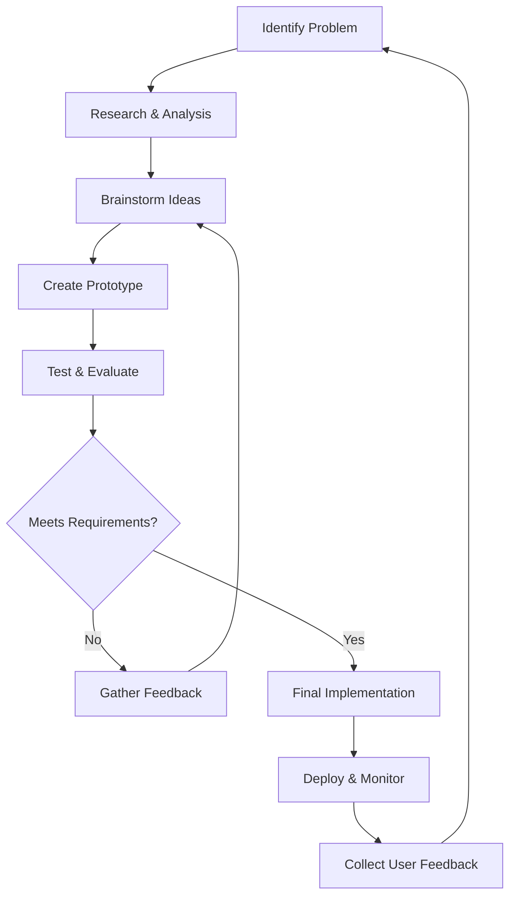

```mermaid
flowchart TD
    A[Identify Problem] --> B[Research & Analysis]
    B --> C[Brainstorm Ideas]
    C --> D[Create Prototype]
    D --> E[Test & Evaluate]
    E --> F{Meets Requirements?}
    F -->|No| G[Gather Feedback]
    G --> C
    F -->|Yes| H[Final Implementation]
    H --> I[Deploy & Monitor]
    I --> J[Collect User Feedback]
    J --> A
```